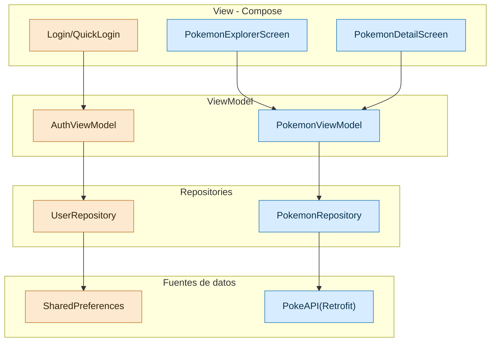
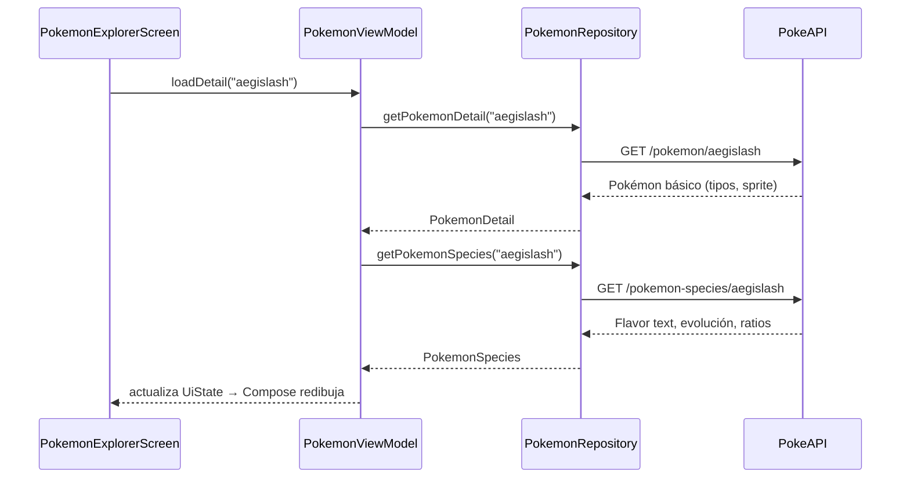

# duoc-App

Aplicación Android construida con Jetpack Compose que ejemplifica un flujo completo de autenticación y consumo de datos remotos usando el patrón **MVVM**. El código está pensado para estudiantes que quieren ver cómo se conectan las capas View → ViewModel → Repository → API con un ejemplo real.

---

## 1. ¿Qué ofrece este repositorio?

- **Autenticación local** con `AuthViewModel` y `UserRepository` respaldando los datos en `SharedPreferences`.
- **Pokédex integrada con PokeAPI**: lista paginada, búsqueda por nombre o número y detalle enriquecido con flavor text, evolución previa, ratio de captura, etc.
- **Navegación Compose** con rutas bien tipadas (`AppScreen`) y un flujo que arranca en login/quick-login y desemboca en la Pokédex.
- **UI 100 % Compose** usando Material 3: `Scaffold`, `LazyColumn`, formularios y top bars.

---

## 2. Arquitectura general

```
View (Compose screens)
    ↕ eventos/estado
PokemonViewModel & AuthViewModel (lógica de presentación)
    ↕ suspend functions
Repositories (PokemonRepository, UserRepository)
    ↕ fuentes de datos
PokeAPI (Retrofit) / SharedPreferences
```

### Vista rápida (Mermaid) del flujo MVVM + PokeAPI



### Capas y archivos clave

| Capa | Responsabilidad | Archivos principales |
| --- | --- | --- |
| **View** | Pantallas Compose | `app/src/main/java/com/example/app/view/*.kt` |
| **ViewModel** | Estado y orquestación | `viewmodel/PokemonViewModel.kt`, `viewmodel/AuthViewModel.kt` |
| **Repository** | Llamadas a la red y persistencia local | `data/PokemonRepository.kt`, `data/UserRepository.kt` |
| **Model** | Data classes para JSON/SharedPreferences | `model/Pokemon.kt`, `model/PokemonSpecies.kt`, `model/User.kt` |
| **Red** | Configuración Retrofit | `data/remote/NetworkModule.kt`, `data/remote/PokemonApiService.kt` |

### Flujo de datos con PokeAPI

1. `PokemonExplorerScreen` invoca `PokemonViewModel.loadList()` o `loadDetail(nombre/id)`.
2. El `PokemonViewModel` consulta a `PokemonRepository`.
3. El `PokemonRepository` usa la instancia de Retrofit (`NetworkModule.api`) y llama a:
   - `GET /pokemon` para la lista (`PokemonListResponse`).
   - `GET /pokemon/{nameOrId}` para el detalle base (`PokemonDetail`).
   - `GET /pokemon-species/{nameOrId}` para flavor text y metadatos (`PokemonSpecies`).
4. El ViewModel actualiza los `UiState` (`PokemonListUiState`, `PokemonDetailUiState`).
5. Los `LazyColumn` y tarjetas Compose se recomponen automáticamente mostrando la nueva información.

Consulta rápida (Mermaid):



---

## 3. Requisitos y configuración

### Dependencias destacadas
- Retrofit + Gson (`com.squareup.retrofit2:retrofit`, `converter-gson`).
- Coroutines (`org.jetbrains.kotlinx:kotlinx-coroutines-core`, `...-android`).
- Coil (`io.coil-kt:coil-compose`) para cargar sprites remotos.
- Material 3 y Navigation Compose.

### Permisos obligatorios
Agrega en `app/src/main/AndroidManifest.xml` (ya incluido):
```xml
<uses-permission android:name="android.permission.INTERNET" />
```
Sin este permiso verás `java.lang.SecurityException: Permission denied (missing INTERNET permission?)` al consultar la API.

### Requisitos del entorno
1. **Android Studio Giraffe+ o equivalente** con soporte para Kotlin/Compose.
2. **Android SDK instalado** (la Codespace usada en la guía NO trae SDK). Si clonas el repo en Codespaces tendrás que instalar el SDK localmente para construir.
3. JDK 11 (el proyecto está configurado con `compileOptions`/`kotlinOptions` = 11).

### Configuración rápida
```bash
# clonar
$ git clone https://github.com/<tu-usuario>/duoc-App.git
$ cd duoc-App

# conceder permisos al wrapper si es necesario
$ chmod +x gradlew

# sincronizar dependencias desde Android Studio (File > Sync Project with Gradle Files)
```

> ⚠️ En Codespaces, los comandos que descargan el gradle wrapper o el SDK pueden fallar por falta de permisos/sandbox. Ejecuta `./gradlew assembleDebug` desde tu máquina local con el SDK configurado.

---

## 4. Cómo ejecutar y qué probar

### Desde Android Studio
1. Conecta/emula un dispositivo (API 28+).
2. Ejecuta el módulo `app` con el botón *Run*. Si la primera descarga de dependencias falla, revisa la sección anterior.

### Con Gradle (línea de comandos)
```bash
$ ./gradlew assembleDebug        # compila el APK
$ ./gradlew lint                 # lint de recursos y Compose
$ ./gradlew testDebugUnitTest    # pruebas locales (si existieran)
```

### Flujos principales a revisar
- Registrar un usuario → cerrar sesión → iniciar sesión con *Quick Login*.
- En la Pokédex:
  - Cambiar `limit` / `offset` para cargar diferentes “páginas”.
  - Buscar por nombre (charizard) o número (6).
  - Abrir el detalle desde la tarjeta → revisar flavor text y volver con la flecha.

---

## 5. Estructura del proyecto (resumen)

```
app/
 └── src/main/java/com/example/app/
     ├── MainActivity.kt
     ├── data/
     │   ├── PokemonRepository.kt
     │   └── remote/
     │       ├── NetworkModule.kt
     │       └── PokemonApiService.kt
     ├── model/
     │   ├── Pokemon.kt
     │   ├── PokemonSpecies.kt
     │   └── User.kt
     ├── view/
     │   ├── AppNavigation.kt
     │   ├── PokemonScreens.kt
     │   ├── Login/Register/Profile/...Screens.kt
     │   └── ...
     └── viewmodel/
         ├── PokemonViewModel.kt
         ├── AuthViewModel.kt
         └── PokemonUiState.kt
```

Documentación de apoyo:
- `docs/00-Fundamentos-Kotlin.md`: conceptos básicos.
- `docs/04-conectando-pokeapi-a-datos.md`: walkthrough detallado del módulo Pokédex.


