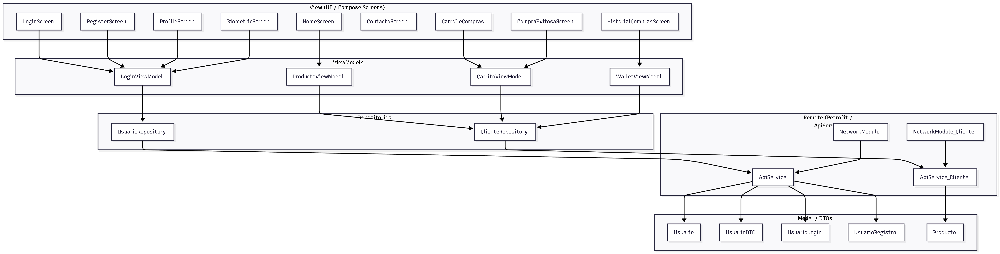
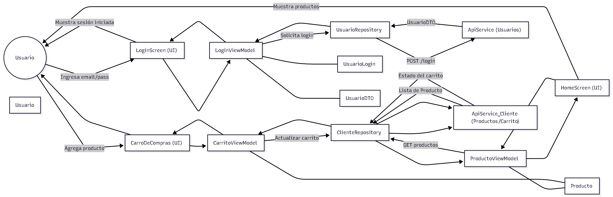
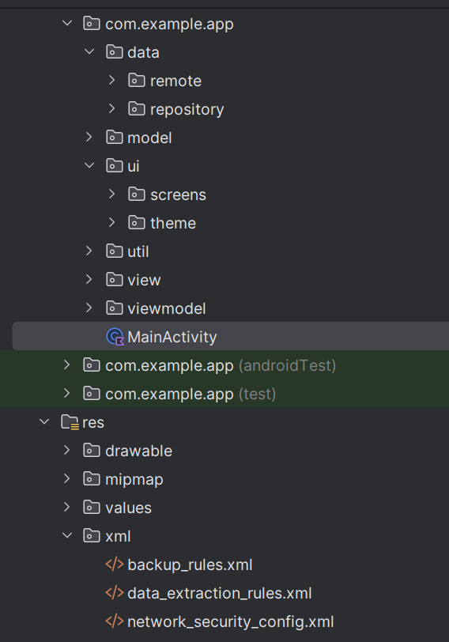

# DigiPymes360
## 1. Descripción General
DigiPymes360 es una aplicación móvil desarrollada en Kotlin, utilizando Jetpack Compose como framework de interfaces modernas declarativas.
La arquitectura implementada corresponde a MVVM (Model–View–ViewModel), lo que permite un diseño modular, mantenible y escalable.
La aplicación consume servicios externos alojados en AWS, los cuales proporcionan datos para los módulos de autenticación, productos, carrito, pedidos, soporte y reportes.
________________________________________
## 2. Arquitectura General del Sistema
El sistema está organizado en capas claramente definidas:
•	View: Compuesta por pantallas desarrolladas en Jetpack Compose.
•	ViewModel: Responsable de la lógica de presentación, administración del estado y respuesta a eventos del usuario.
•	Repository: Encargado de la comunicación con fuentes de datos locales o remotas.
•	Data Sources: Incluye la API externa (AWS) consumida mediante Retrofit y mecanismos de persistencia local como SharedPreferences.
## 3. Diagrama MVVM

## 4. Diagrama de Secuencia

## 5. Capas del Proyecto
•	View: Pantallas del usuario construidas en Jetpack Compose.
•	ViewModel: Manejo del estado, eventos y comunicación con los repositorios.
•	Repository: Coordinación del acceso a datos remotos (API AWS) y locales.
•	Models: Estructuras de datos utilizadas en la aplicación.
•	Data: Configuración de Retrofit, servicios de red y almacenamiento local.

## 6. Estructura del Proyecto

